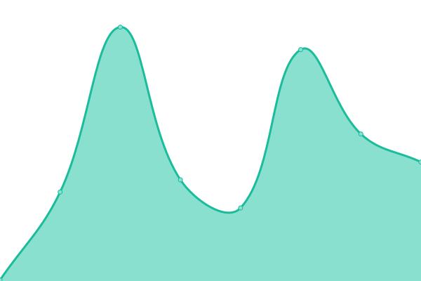
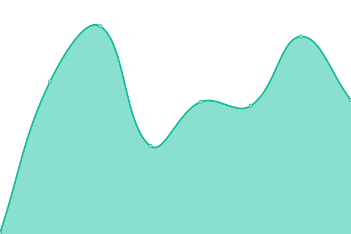
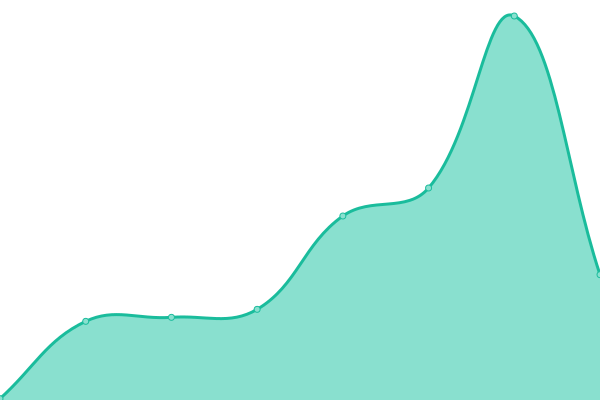
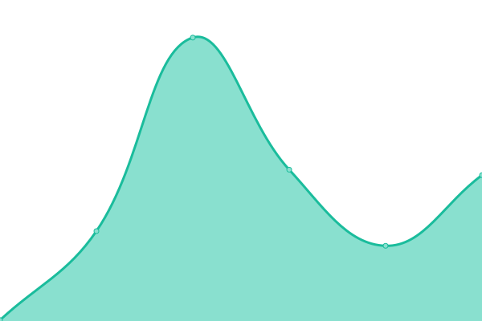
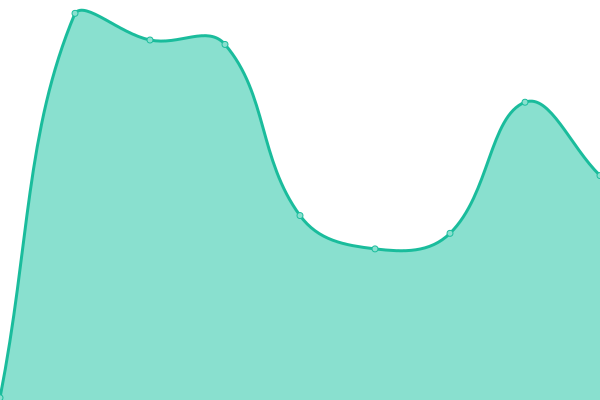
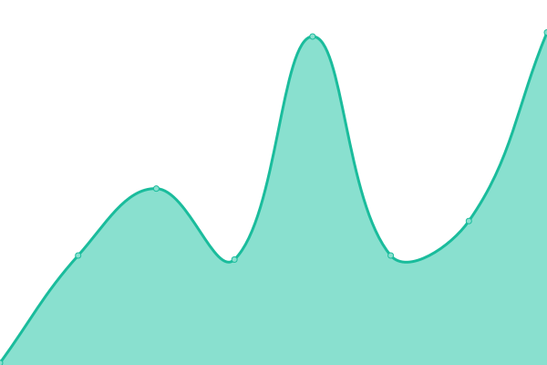
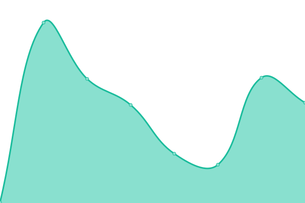
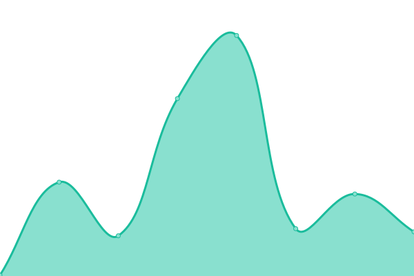
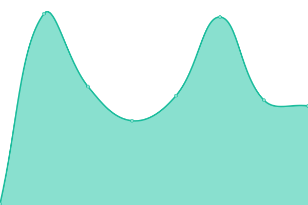
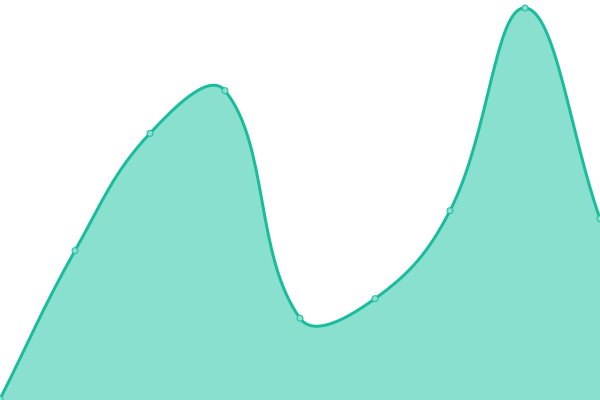

# mifan Status

Status page for `mifan.im` and related project sites, powered by Upptime.

## Current Status

<!--start: status pages-->
<!-- This summary is generated by Upptime (https://github.com/upptime/upptime) -->
<!-- Do not edit this manually, your changes will be overwritten -->
<!-- prettier-ignore -->
| URL | Status | History | Response Time | Uptime |
| --- | ------ | ------- | ------------- | ------ |
|  [mifan.im](https://mifan.im/) | 🟩 Up | [mifan-im.yml](https://github.com/mifanTeddy/status.mifan.im/commits/HEAD/history/mifan-im.yml) | 

 249ms
     
 | 

<a href="https://status.mifan.im/history/mifan-im">100.00%</a>
    

|  [Links](https://links.mifan.im/) | 🟩 Up | [links.yml](https://github.com/mifanTeddy/status.mifan.im/commits/HEAD/history/links.yml) | 

 234ms
     
 | 

<a href="https://status.mifan.im/history/links">100.00%</a>
    

|  [Daily](https://daily.mifan.im/) | 🟩 Up | [daily.yml](https://github.com/mifanTeddy/status.mifan.im/commits/HEAD/history/daily.yml) | 

 216ms
     
 | 

<a href="https://status.mifan.im/history/daily">100.00%</a>
    

|  [AI World](https://world.mifan.im/) | 🟩 Up | [ai-world.yml](https://github.com/mifanTeddy/status.mifan.im/commits/HEAD/history/ai-world.yml) | 

 250ms
     
 | 

<a href="https://status.mifan.im/history/ai-world">100.00%</a>
    

|  [Games](https://games.mifan.im/) | 🟩 Up | [games.yml](https://github.com/mifanTeddy/status.mifan.im/commits/HEAD/history/games.yml) | 

 181ms
     
 | 

<a href="https://status.mifan.im/history/games">100.00%</a>
    

|  [Disperse](https://disperse.mifan.im/) | 🟩 Up | [disperse.yml](https://github.com/mifanTeddy/status.mifan.im/commits/HEAD/history/disperse.yml) | 

 172ms
     
 | 

<a href="https://status.mifan.im/history/disperse">100.00%</a>
    

|  [Avatar](https://avatar.mifan.im/) | 🟩 Up | [avatar.yml](https://github.com/mifanTeddy/status.mifan.im/commits/HEAD/history/avatar.yml) | 

 218ms
     
 | 

<a href="https://status.mifan.im/history/avatar">100.00%</a>
    

|  [Quiz](https://quiz.mifan.im/) | 🟩 Up | [quiz.yml](https://github.com/mifanTeddy/status.mifan.im/commits/HEAD/history/quiz.yml) | 

 239ms
     
 | 

<a href="https://status.mifan.im/history/quiz">100.00%</a>
    

|  [Maple Doll](https://maple.mifan.im/) | 🟩 Up | [maple-doll.yml](https://github.com/mifanTeddy/status.mifan.im/commits/HEAD/history/maple-doll.yml) | 

 190ms
     
 | 

<a href="https://status.mifan.im/history/maple-doll">100.00%</a>
    

|  [Art](https://art.mifan.im/) | 🟩 Up | [art.yml](https://github.com/mifanTeddy/status.mifan.im/commits/HEAD/history/art.yml) | 

 136ms
     
 | 

<a href="https://status.mifan.im/history/art">100.00%</a>
    

|  [Cat Avatar](https://cat.mifan.im/) | 🟩 Up | [cat-avatar.yml](https://github.com/mifanTeddy/status.mifan.im/commits/HEAD/history/cat-avatar.yml) | 

 158ms
     
 | 

<a href="https://status.mifan.im/history/cat-avatar">100.00%</a>
    

|  [Dog Avatar](https://dog.mifan.im/) | 🟩 Up | [dog-avatar.yml](https://github.com/mifanTeddy/status.mifan.im/commits/HEAD/history/dog-avatar.yml) | 

 137ms
     
 | 

<a href="https://status.mifan.im/history/dog-avatar">100.00%</a>
    

|  [Pig Avatar](https://pig.mifan.im/) | 🟩 Up | [pig-avatar.yml](https://github.com/mifanTeddy/status.mifan.im/commits/HEAD/history/pig-avatar.yml) | 

 164ms
     
 | 

<a href="https://status.mifan.im/history/pig-avatar">100.00%</a>
    

|  [Meme](https://meme.mifan.im/) | 🟩 Up | [meme.yml](https://github.com/mifanTeddy/status.mifan.im/commits/HEAD/history/meme.yml) | 

 228ms
     
 | 

<a href="https://status.mifan.im/history/meme">100.00%</a>
    

|  [Palette Studio](https://palette.mifan.im/) | 🟩 Up | [palette-studio.yml](https://github.com/mifanTeddy/status.mifan.im/commits/HEAD/history/palette-studio.yml) | 

 168ms
     
 | 

<a href="https://status.mifan.im/history/palette-studio">100.00%</a>
    

|  [Muscle](https://muscle.mifan.im/) | 🟩 Up | [muscle.yml](https://github.com/mifanTeddy/status.mifan.im/commits/HEAD/history/muscle.yml) | 

 113ms
     
 | 

<a href="https://status.mifan.im/history/muscle">100.00%</a>
    

|  [Tools](https://tools.mifan.im/) | 🟩 Up | [tools.yml](https://github.com/mifanTeddy/status.mifan.im/commits/HEAD/history/tools.yml) | 

 106ms
     
 | 

<a href="https://status.mifan.im/history/tools">100.00%</a>
    

|  [Math](https://math.mifan.im/) | 🟩 Up | [math.yml](https://github.com/mifanTeddy/status.mifan.im/commits/HEAD/history/math.yml) | 

 93ms
     
 | 

<a href="https://status.mifan.im/history/math">100.00%</a>
    

|  [Physics](https://physics.mifan.im/) | 🟩 Up | [physics.yml](https://github.com/mifanTeddy/status.mifan.im/commits/HEAD/history/physics.yml) | 

 117ms
     
 | 

<a href="https://status.mifan.im/history/physics">100.00%</a>
    

|  [Tuixiu](https://tuixiu.mifan.im/) | 🟩 Up | [tuixiu.yml](https://github.com/mifanTeddy/status.mifan.im/commits/HEAD/history/tuixiu.yml) | 

 132ms
     
 | 

<a href="https://status.mifan.im/history/tuixiu">100.00%</a>
    

|  [Worth Job](https://worthjob.mifan.im/) | 🟩 Up | [worth-job.yml](https://github.com/mifanTeddy/status.mifan.im/commits/HEAD/history/worth-job.yml) | 

 126ms
     
 | 

<a href="https://status.mifan.im/history/worth-job">100.00%</a>
    

|  [Focus](https://focus.mifan.im/) | 🟩 Up | [focus.yml](https://github.com/mifanTeddy/status.mifan.im/commits/HEAD/history/focus.yml) | 

 140ms
     
 | 

<a href="https://status.mifan.im/history/focus">100.00%</a>
    

|  [Draw](https://draw.mifan.im/) | 🟩 Up | [draw.yml](https://github.com/mifanTeddy/status.mifan.im/commits/HEAD/history/draw.yml) | 

 108ms
     
 | 

<a href="https://status.mifan.im/history/draw">100.00%</a>
    

|  [Streak](https://streak.mifan.im/) | 🟩 Up | [streak.yml](https://github.com/mifanTeddy/status.mifan.im/commits/HEAD/history/streak.yml) | 

 107ms
     
 | 

<a href="https://status.mifan.im/history/streak">100.00%</a>
    

|  [Meal](https://meal.mifan.im/) | 🟩 Up | [meal.yml](https://github.com/mifanTeddy/status.mifan.im/commits/HEAD/history/meal.yml) | 

 159ms
     
 | 

<a href="https://status.mifan.im/history/meal">100.00%</a>
    

|  [Resume](https://resume.mifan.im/) | 🟩 Up | [resume.yml](https://github.com/mifanTeddy/status.mifan.im/commits/HEAD/history/resume.yml) | 

 760ms
     
 | 

<a href="https://status.mifan.im/history/resume">100.00%</a>
    

|  [Blog](https://blog.mifan.im/) | 🟩 Up | [blog.yml](https://github.com/mifanTeddy/status.mifan.im/commits/HEAD/history/blog.yml) | 

 132ms
     
 | 

<a href="https://status.mifan.im/history/blog">100.00%</a>
    

|  [Now](https://now.mifan.im/) | 🟩 Up | [now.yml](https://github.com/mifanTeddy/status.mifan.im/commits/HEAD/history/now.yml) | 

 237ms
     
 | 

<a href="https://status.mifan.im/history/now">100.00%</a>
    

|  [Lab](https://lab.mifan.im/) | 🟩 Up | [lab.yml](https://github.com/mifanTeddy/status.mifan.im/commits/HEAD/history/lab.yml) | 

 125ms
     
 | 

<a href="https://status.mifan.im/history/lab">100.00%</a>
    

|  [API](https://api.mifan.im/) | 🟩 Up | [api.yml](https://github.com/mifanTeddy/status.mifan.im/commits/HEAD/history/api.yml) | 

 159ms
     
 | 

<a href="https://status.mifan.im/history/api">100.00%</a>
    

|  [Changelog](https://changelog.mifan.im/) | 🟩 Up | [changelog.yml](https://github.com/mifanTeddy/status.mifan.im/commits/HEAD/history/changelog.yml) | 

 234ms
     
 | 

<a href="https://status.mifan.im/history/changelog">100.00%</a>
    

<!--end: status pages-->

## How It Works

- GitHub Actions checks configured endpoints every 5 minutes.
- GitHub Issues are used as incidents when an endpoint is down.
- GitHub Pages publishes the public status page at `https://status.mifan.im`.
- Response-time history and uptime summaries are committed back into this repository.

## Important Notes

- `math.mifan.im` currently returns `401` because it is behind Vercel authentication, so `401` is configured as the expected healthy response.
- `muscle.mifan.im` currently returns `307`, so `307` is configured as an expected healthy response.
- If either site becomes public later, update `.upptimerc.yml` and rerun the Setup CI workflow.
